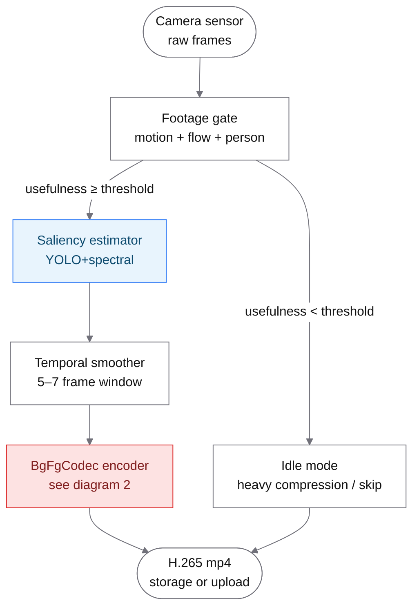
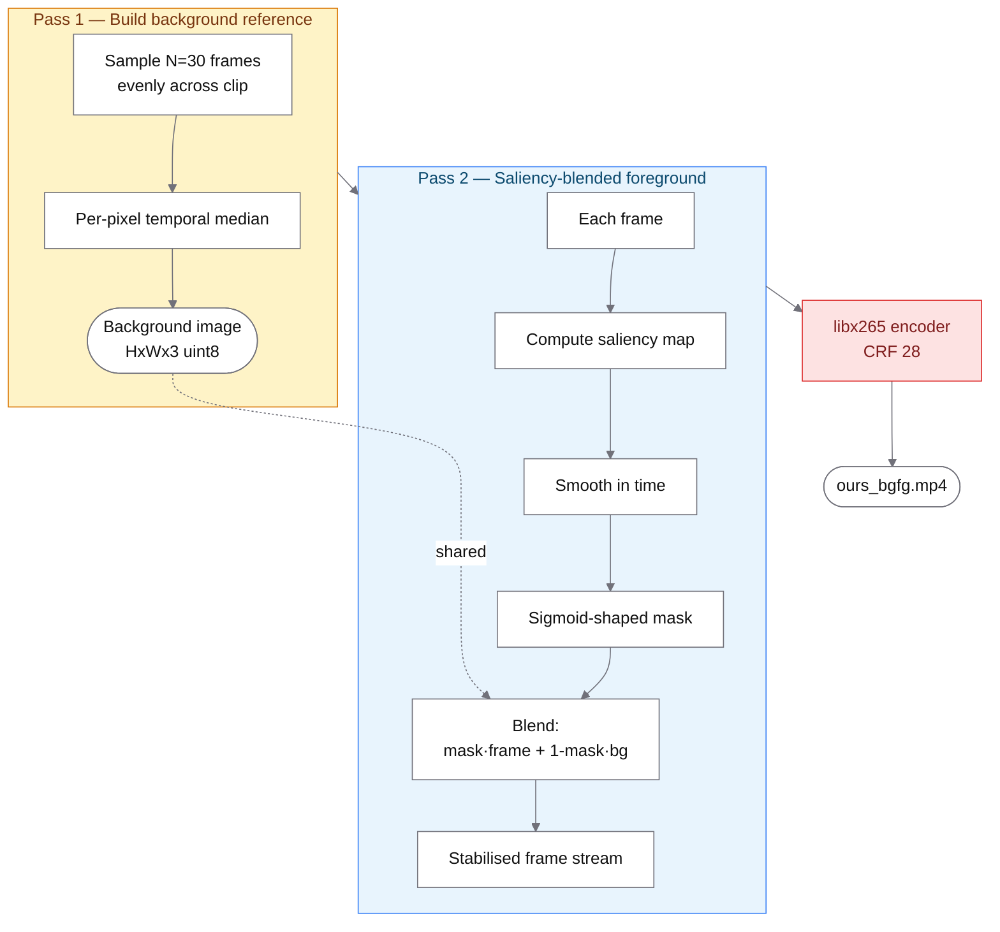
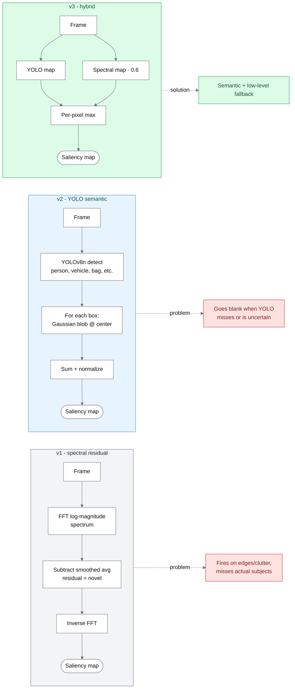
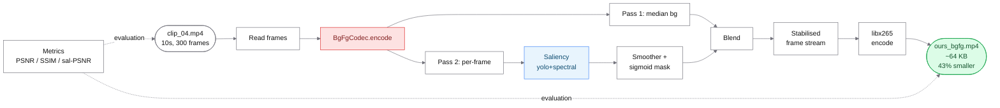
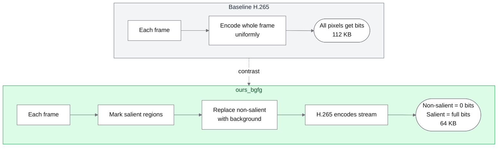

# STEAM IC — Architecture & Pipeline Overview

A guide to how the system works end-to-end, written for team members who need
to explain it to others. Every section has a diagram + short notes on what
matters most.

> Render note: GitHub, VS Code, Notion, and Obsidian all render Mermaid
> diagrams natively. Just open this file.

---

## 1. Camera deployment runtime — what runs on the device

This is what happens on the camera once we ship. Frames come in from the
sensor, get gated, get analyzed for saliency, get encoded, and get stored or
uploaded.

**Notes for each step:**

- **Footage gate** (`src/gate.py`): cheap CPU check that decides if anything
  interesting is happening. Uses MOG2 background subtraction (motion), sparse
  optical flow (movement magnitude), and optional YOLOv8n person detection.
  Threshold tunable (default 0.25). Saves enormous power on long idle periods.
- **Saliency estimator** (`src/saliency.py`): per-frame map showing where the
  important content is. Backend selectable — see diagram 3.
- **Temporal smoother**: moving-average over recent saliency maps. Prevents
  flicker (without this, the saliency map jitters every frame and the codec
  wastes bits encoding the jitter).
- **BgFgCodec encoder**: our main innovation. See diagram 2.
- **Idle mode**: when nothing interesting is happening, encode with very
  aggressive compression (or skip entirely). Saves storage + bandwidth.

---

## 2. BgFgCodec internals — the two-pass encoder

This is our headline innovation. It's a thin pre-processor in front of an
unmodified H.265 encoder. Two passes per clip.

**Notes for each step:**

- **Sample 30 frames + per-pixel median**: builds a clean "what does the empty
  scene look like" reference. Temporal median is robust to short-lived
  foreground — a person walking through won't pollute the background because
  no pixel stays "non-background" for more than a fraction of the clip.
- **Saliency + temporal smoothing**: see diagram 3 for backends.
- **Sigmoid-shaped mask**: converts continuous saliency [0,1] into a soft
  blending weight. Steep transition centered at `threshold=0.3`, so salient
  interior is fully preserved, non-salient interior fully replaced, and the
  boundary is smooth (no visible seams).
- **Blend**: `stabilised = mask·frame + (1−mask)·background`. The salient
  regions keep their original pixels; non-salient regions are replaced with
  the matching background pixel at that exact location.
- **libx265 encode**: the magic step. Because non-salient pixels are now
  **byte-identical across frames**, H.265's inter-frame prediction reduces
  those regions to ~zero bits via skip flags. All bitrate flows to the
  foreground. The output is a normal H.265 mp4 — no custom decoder needed.

**Key insight:** we're not replacing H.265. We're feeding H.265 a stream that
plays to its strengths. Every byte the codec saves on the static background
is a byte it can spend on the action.

---

## 3. Saliency backend evolution — why three backends exist

The saliency map tells the codec "this is what to preserve." Getting this
right was where we had the biggest perceptual gains. We have three backends
now, each addressing a problem with the previous one.

**Notes for each backend:**

- **v1 — spectral residual** (Hou & Zhang 2007, OpenCV built-in):
  closed-form FFT trick. Subtracts the smoothed log-magnitude spectrum from
  the raw one — what's left is "the parts of this image that deviate from
  the typical 1/f natural-image statistics." Fast (100+ fps), no training.
  *Problem*: it's novelty-driven, not semantic. Fires on high-contrast edges,
  cluttered textures, and timestamps in the corner. Misses uniformly-lit
  humans walking across a clean floor. This is why clip_04 lost the pool
  sticks — the saliency map said the cue sticks weren't unusual enough.

- **v2 — YOLO semantic** (new — `YoloSaliency`): YOLOv8n detections drive
  Gaussian blobs centered at each detection box, with σ proportional to box
  size and amplitude equal to detection confidence. We restrict to a
  surveillance-relevant class subset: person, bicycle, car, motorcycle, bus,
  truck, bird, cat, dog, backpack, handbag, suitcase, bottle, knife, laptop,
  cell phone, book. Picks up what we actually care about.
  *Problem*: when YOLO is uncertain (poor lighting, occlusion, unfamiliar
  pose), the saliency map can collapse to near-empty, which then makes the
  codec replace large regions with background — visible artifacts.

- **v3 — yolo+spectral hybrid** (new — default): per-pixel max of the YOLO
  map and a scaled spectral residual map. Best of both worlds: YOLO drives
  the semantic foreground, spectral residual provides a low-level safety net
  for regions YOLO missed. This is the production default.

---

## 4. The full data path — a single clip's journey

Putting it all together: one mp4 file going through the entire system to
become a smaller mp4 file.

**Notes on the journey:**

- **Inputs**: any mp4 — surveillance clips, webcam captures, anything from a
  stationary camera. The pipeline doesn't know or care about the source.
- **Two passes**: pass 1 builds the background once per clip (~1s overhead),
  pass 2 processes every frame. Total time on a 10-second 640×360 clip:
  ~3-5 seconds on a laptop CPU.
- **Output**: a standards-compliant H.265 mp4. Plays in any modern video
  player. Decoders have no idea it was pre-processed.
- **Evaluation**: PSNR (pixel fidelity), SSIM (structural similarity),
  sal-PSNR (fidelity only in salient regions). The last one is the honest
  metric for our codec — see writeup section.

---

## 5. Why this beats baseline H.265 — the intuition

Baseline H.265 has no idea what's important. It spends bits on every pixel
of every frame, weighted by the codec's internal heuristics (which prefer
"interesting" regions but don't know what an "interesting" region IS).

**The two-line pitch:**

> Baseline H.265 wastes bits encoding the parts of the scene that never
> change. We feed H.265 a version of the video where the background pixels
> are byte-identical across frames, so its inter-frame prediction collapses
> those regions to ~zero bits. All saved bits go to the foreground —
> 43% smaller files at comparable perceived quality on the regions that
> matter.

---

## 6. Quick reference — files & responsibilities

| Module | Job |
|---|---|
| `src/saliency.py` | All saliency backends (spectral, finegrained, yolo, yolo+spectral). Temporal smoothing. |
| `src/gate.py` | Footage gate (motion + flow + person). Decides if recording is worth it. |
| `src/compress.py` | Saliency-aware blur+H.265 pipeline (`ours_sigmoid`). The previous approach. |
| `src/bg_fg_codec.py` | The new bg/fg decomposition codec (`ours_bgfg`). Our headline innovation. |
| `src/pipeline.py` | Wires `ours_sigmoid` end-to-end. Used by run_pipeline.py. |
| `src/metrics.py` | PSNR, SSIM, LPIPS, and **saliency-weighted PSNR** (the honest metric for our codec). |
| `src/neural_codec.py` | Single-frame autoencoder (the *naive learned-codec baseline* — not competitive). |
| `scripts/ablation_bgfg.py` | The three-way comparison: baseline / ours_sigmoid / ours_bgfg. |
| `scripts/qualitative_catalog_v2.py` | 5-panel comparison PDF for showcase example selection. |
| `scripts/photo_demo.py` | Live webcam demo, all three encoders side by side. |
| `docs/writeup_updates.md` | Drop-in sections for analysis.docx. |
